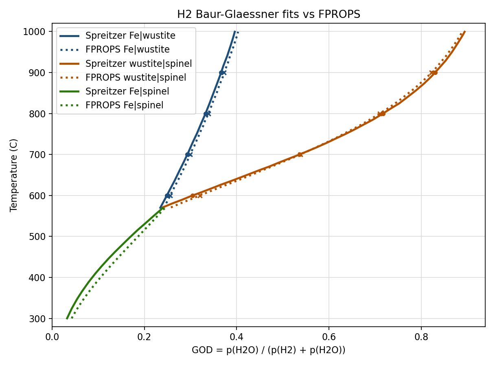

# FPROPS Fe-O / Fe-O-H Implementation Note

## 1. Purpose

This note records the current implementation status for the `Fe-O`
backbone (Tier 2) and the first `Fe-O-H` extension (Tier 3) in
FPROPS.

The earlier version of this file had grown into a debugging log.
That material has now been condensed into the present-state summary
below:

- what is implemented
- what is actively validated
- what remains approximate
- what is good enough to use going forward

Current position:

- Tier 2 `Fe-O` is implemented and usable
- Tier 3 `Fe-O-H` is implemented and in good enough agreement with
  the corrected Spreitzer/Schenk $\mathrm{H_2}$ traces to proceed
- Tier 4-style `Fe-O-C-H` boundary work is usable on the same basis
- the main remaining weakness is the reduced spinel side, especially
  the low-temperature $\mathrm{Fe|spinel}$ branch

## 1.1 Condensed History

The shortest honest summary of how we got here is:

1. The early large errors were real implementation issues.
   The most important one was a misread of the Hidayat wustite excess
   term, which had been treated like a Redlich-Kister term when it was
   not. Fixing that brought `Fe|wustite` close to Hidayat and BG.
2. A later large error was a mixed-source gas-basis problem.
   Using raw cloned Reaktoro gas data against the Hidayat Fe-O oxide
   package made both H2 and CO reduction curves look much worse than
   they should. Moving back to `helmholtz+ref0:` fixed most of that.
3. The remaining defect is now localized.
   The Hidayat oxide-side checks are broadly good, the gas-side
   chemistry is broadly good, and the persistent residual is the
   low-temperature reduced spinel behaviour.
4. The first `mmc1.dat`-driven magnetic reconstruction (`mmc1_guess`)
   improved the oxidized side but did not materially fix the reduced
   spinel BG branches.
5. A second pass, guided by the actual BG/Hidayat tradeoff rather than
   by abstract magnetic similarity alone, produced the current
   provisional variant `hidayat_adj1`.

## 1.2 Current Gaps

What still does not line up perfectly:

- the low-temperature `Fe|spinel` BG branch is still not fully captured
- `CO` and `H2` BG traces are not perfectly consistent with each other
  on a common oxygen-potential basis
- the exact FactSage/ChemSage `SUBLM` magnetic realization behind
  `mmc1.dat` is still not fully reconstructed

What is good enough for current use:

- the oxide ladder is coherent enough to support further kinetic work
- `hidayat_adj1` is the best available practical spinel source so far
- the remaining mismatch is modest enough that it should no longer block
  kinetic-model development

## 2. Recommended Working Position

Use the current Tier 3 model as the baseline for:

- Tier 4 `Fe-O-C-H`
- further Fe-O-H equilibrium studies
- hydrogen reduction-boundary work centered on
  $\mathrm{Fe|wustite}$
- current kinetic-model work using the provisional spinel source
  `hidayat_adj1`

Confidence level by boundary:

- high: gas-side reference-state handling
- high: $\mathrm{Fe|wustite}$
- moderate: $\mathrm{wustite|spinel}$
- moderate: $\mathrm{Fe|spinel}$ with `hidayat_adj1`

The main unresolved issue is no longer the gas side. It is still the
reduced spinel model, but now at the level of refinement rather than a
blocking defect.

Solver position:

- the current Fe-O-H and Fe-O-C phase-equilibrium checks should normally be
  run with the default NLOPT/SLSQP-backed FPROPS build
- IPOPT may be linked in the default build, but it is treated as an explicit
  cross-check for this work; plain `auto` still selects the NLOPT/SLSQP
  equilibrium backend
- local May 2026 timings showed the full CUnit suite passing in about 2.3 s
  with SLSQP-only FPROPS, compared with about 186 s with IPOPT-only FPROPS;
  the phase suite difference was even more pronounced, about 0.6 s versus
  about 180 s
- IPOPT now has a scaled full-space amount formulation, `ipopt_scaled_n`,
  matching the SLSQP variable scaling. Plain `ipopt` now uses that scaled
  formulation, while `ipopt_logn` and `ipopt_n` are explicit alternatives. This
  improved robustness on the active-set phase cases, but an
  IPOPT-enabled phase-suite check still took about 185 s CUnit elapsed time.
- the two SLSQP-only failures found during this comparison were numerical/API
  robustness issues, not evidence that IPOPT was intrinsically needed:
  spinel needed zero initial expanded-member scales clamped, and the low-T NOx
  reduced solve needed a validated near-stationary max-iteration acceptance

## 3. Current Thermodynamic Model

### 3.1 Gas species

For Tier 3 work, the preferred gas source is:

- `helmholtz+ref0:`

This now gives chemistry-compatible standard states for:

- `H2`
- `H2O`
- `O2`

The old gas-reference problems were real and have been corrected.
Reaction-level agreement is now good between:

- `helmholtz+ref0:`
- corrected Moran and Shapiro ideal-gas data
- corrected `ideal+ref0:RPP`

For the reaction

$$
\mathrm{H_2} + \tfrac12 \mathrm{O_2} \rightarrow \mathrm{H_2O},
$$

these sources now agree closely on $\Delta G^\circ(T)$.

### 3.2 Metallic iron

Metallic iron is represented by:

- `Fe_bcc`
- `Fe_fcc`

with unary Hillert-Jarl magnetic corrections.

This side is now in good shape:

- the `bcc/fcc` crossover occurs near the expected $912^\circ \mathrm{C}$
- the metallic side is no longer the dominant source of error

### 3.3 Wustite

Wustite is implemented as the accepted Hidayat et al. (2015)
Bragg-Williams binary solution:

$$
(1-x)\,\mathrm{FeO} + x\,\mathrm{FeO}_{1.5}
$$

with

$$
g(T,x) = (1-x) g^\circ_{\mathrm{FeO}}(T) + x g^\circ_{\mathrm{FeO}_{1.5}}(T) + RT\left[(1-x)\ln(1-x) + x\ln x\right] + g^{ex}(T,x)
$$

and

$$
g^{ex}(T,x) = X_{\mathrm{FeO}} X_{\mathrm{FeO}_{1.5}} \left(q^{00} + q^{10} X_{\mathrm{FeO}}\right)
$$

with:

- $q^{00}$ = -59412.8 J/mol
- $q^{10}$ = 42676.8 J/mol

Important historical point:

- the largest early Tier 2 error came from misreading this excess
  term as a Redlich-Kister form
- once corrected, the $\mathrm{Fe|wustite}$ boundary moved
  into close agreement with Hidayat

### 3.4 Spinel / magnetite side

Spinel is currently represented by a reduced Fe-only spinel CEF
slice derived from Degterov et al. (2001), with the `Fe3O4`
endmember adjusted to the Hidayat 2015 value.

This model includes:

- tetrahedral $\mathrm{Fe^{2+}}$ / $\mathrm{Fe^{3+}}$
- octahedral $\mathrm{Fe^{2+}}$ / $\mathrm{Fe^{3+}}$ / vacancy
- configurational entropy
- a unary magnetic term

But it is still a reduced model, not the full spinel treatment of
the Hidayat/FactSage Fe-O assessment.

This is the weakest remaining part of the present Tier 3 model.

#### 3.4.1 Implemented reduced CEF equations (current code)

In the current implementation, the spinel member set is:

- tetrahedral: `Sp_Fe2_tet`, `Sp_Fe3_tet`
- octahedral: `Sp_Fe2_oct`, `Sp_Fe3_oct`, `Sp_Va_oct`

with \(A \equiv \mathrm{Fe^{2+}}\), \(E \equiv \mathrm{Fe^{3+}}\),
\(V \equiv \mathrm{Va}\).

For member amounts \(n_i\):

$$
n_t = n_{A,t} + n_{E,t}, \quad
n_o = n_{A,o} + n_{E,o} + n_{V,o}, \quad
n_{\phi} = n_t
$$

and site fractions

$$
y_{A,t} = \frac{n_{A,t}}{n_t}, \; y_{E,t} = \frac{n_{E,t}}{n_t}, \;
y_{A,o} = \frac{n_{A,o}}{n_o}, \; y_{E,o} = \frac{n_{E,o}}{n_o}, \; y_{V,o} = \frac{n_{V,o}}{n_o}.
$$

The model uses

$$
G_{AE}(T)=G_{EA}(T)=g_{AE}(T),
$$
$$
G_{EE}(T)=g_{AE}(T)+I_{AE}(T), \quad
G_{AA}(T)=g_{AE}(T)-I_{AE}(T)+\Delta_{AE},
$$
$$
G_{EV}(T)=\frac{5}{7}g_{AE}(T)+V_E(T), \quad
G_{AV}(T)=\frac{5}{7}g_{AE}(T)+V_E(T)-I_{AE}(T)+\Delta_{AE}-\Delta_{EAV}.
$$

with

$$
g_{AE}(T)= -1140237 + 1015.067\,T - 0.008149197\,T^2 - 174.832\,T\ln T + \frac{1445276}{T},
$$
$$
I_{AE}(T)= -31229 + 22.063\,T, \quad
V_E(T)= 29932 + 28.547\,T, \quad
\Delta_{AE}=15781, \quad
\Delta_{EAV}=0.
$$

The molar CEF mixing part is

$$
\begin{aligned}
G_{\mathrm{mix}} =\;&
y_{A,t}y_{A,o}G_{AA}
+y_{A,t}y_{E,o}G_{AE}
+y_{A,t}y_{V,o}G_{AV} \\
&+y_{E,t}y_{A,o}G_{EA}
+y_{E,t}y_{E,o}G_{EE}
+y_{E,t}y_{V,o}G_{EV},
\end{aligned}
$$

and the configurational entropy term is

$$
S_{\mathrm{conf}} = -R\left[
y_{A,t}\ln y_{A,t}+y_{E,t}\ln y_{E,t}
+2\left(y_{A,o}\ln y_{A,o}+y_{E,o}\ln y_{E,o}+y_{V,o}\ln y_{V,o}\right)
\right].
$$

A Hillert-Jarl magnetic term \(G_{\mathrm{mag}}(T)\) is added
(\(T_{ord}=848\), \(\beta=44.54\), \(p=0.28\)), giving

$$
G_{\phi} = n_{\phi}\left(G_{\mathrm{mix}} - T S_{\mathrm{conf}} + G_{\mathrm{mag}}\right).
$$

The member chemical potentials are obtained numerically from finite
differences of \(G_{\phi}\) with respect to member amounts in the C
implementation.

### 3.5 Hematite

`Fe2O3` is still handled on a pragmatic condensed basis with a unary
magnetic correction. It is adequate for the present Tier 3 scope,
but not yet the focus of the remaining mismatch.

## 4. Equilibrium Formulation

The key architectural point from Tier 2 remains:

- condensed solution phases are handled in full-space Gibbs
  minimization
- wustite is solved through endmember amounts rather than an explicit
  top-level `x` variable

This keeps:

- element balances linear
- the overall optimization framework intact

For wustite endmembers \(A=\mathrm{FeO}\), \(B=\mathrm{FeO}_{1.5}\),
the elemental potentials implied by \((\mu_A,\mu_B)\) are

$$
\lambda_O = 2(\mu_B-\mu_A), \qquad
\lambda_{Fe} = 3\mu_A - 2\mu_B.
$$

These are used in the boundary diagnostics through grand-potential
residuals. For the reduced spinel phase:

$$
\Phi_{\mathrm{sp}} = G_{\mathrm{sp}} - \lambda_{Fe}N_{Fe} - \lambda_ON_O,
$$

and coexistence is checked by minimizing \(\Phi_{\mathrm{sp}}\) over
admissible spinel site states and testing whether the minimum is near
zero.

The engine now supports:

- pure condensed phases
- ideal gas species
- binary condensed solutions
- the reduced Fe-only spinel phase

## 5. Active Validation

This section records the validation that should still be treated as
active and relevant.

### 5.1 Tier 2 Fe-O validation: Hidayat

The following are now well supported:

- wustite thermodynamics
- $\mathrm{Fe|wustite}$ boundary
- iron `bcc/fcc` crossover

The important Hidayat-side lesson was:

- the wustite implementation bug is fixed
- the metallic side is no longer the dominant issue
- the remaining Tier 2 discrepancy is localized to the oxide ladder,
  not the gas side

### 5.2 Tier 2 Fe-O validation: O'Neill (1988)

The OCR copy used for this work is:
[oneill-1988-ocr.pdf](test/oneill-1988-ocr.pdf)

The useful comparison is on the relative oxygen-potential basis

$$
\mu_{O_2}^{rel} = 2\lambda_O - \mu^\circ_{O_2}(T,p^\circ)
$$

not on raw absolute $2\lambda_O$.

#### $\mathrm{Fe|wustite}$

This boundary now agrees very well with O'Neill:

| T (°C) | Model $\mu_{O_2}^{rel}$ | O'Neill | Delta |
|---:|---:|---:|---:|
| 570 | -418378.0 | -418172.3 | -205.7 |
| 600 | -414566.5 | -414362.5 | -204.0 |
| 700 | -401882.3 | -401643.2 | -239.1 |
| 800 | -388965.7 | -388725.7 | -240.0 |
| 900 | -376005.0 | -375619.9 | -385.1 |
| 1000 | -362870.7 | -362431.9 | -438.9 |

All values are in `J/mol O2`.

This is strong evidence that the current
$\mathrm{Fe|wustite}$ boundary is already correctly placed
on the condensed-side oxygen-potential scale.

#### $\mathrm{wustite|spinel}$

This is where the remaining oxide-side problem sits.

Using the same O'Neill basis, the current model near the invariant
region is still too oxidized by several `kJ/mol O2`:

| T (°C) | Model $\mu_{O_2}^{rel}$ | O'Neill | Delta |
|---:|---:|---:|---:|
| 570 | -421804.8 | -417188.1 | -4616.6 |
| 575 | -420646.2 | -416016.9 | -4629.3 |
| 600 | -414727.2 | -410143.9 | -4583.3 |

So the O'Neill comparison localizes the main remaining error very
cleanly:

- $\mathrm{Fe|wustite}$ is essentially right
- $\mathrm{wustite|spinel}$ is still shifted

### 5.3 Tier 3 Fe-O-H validation: Spreitzer/Schenk

The earlier severe mismatch turned out to be a false alarm:

- the first traced curves used for comparison were from the
  `Fe-O-C` diagram, not the `Fe-O-H` diagram

After switching to the corrected $\mathrm{H_2}$-based traced lines, the
Tier 3 picture improved substantially.

The current comparison plot is:
[bg_compare_all_h2_helmholtz_plus_ref0.png](res/bg_compare_all_h2_helmholtz_plus_ref0.png)



This plot compares the current FPROPS Tier 3 curves against the
corrected $\mathrm{H_2}$-based traced lines for:

- $\mathrm{Fe|wustite}$
- $\mathrm{wustite|spinel}$
- $\mathrm{Fe|spinel}$

Assessment:

- overall agreement is now good
- $\mathrm{Fe|wustite}$ is especially good
- $\mathrm{Fe|spinel}$ is reasonable
- the main visible residual discrepancy remains
  $\mathrm{wustite|spinel}$

That level of agreement is good enough to proceed with Tier 4 and
other Tier 3-based work.

## 6. What Was Fixed And Should Stay Fixed

These items were genuine bugs or design gaps and should be treated
as resolved unless new evidence appears.

### 6.1 Chemistry-compatible gas reference states

The gas-side reference-state handling is now substantially better:

- native Helmholtz fluids carry real `ref0` chemistry anchors
- `helmholtz+ref0:` is usable for equilibrium chemistry
- Moran and Shapiro ideal-gas files were corrected
- the RPP path was corrected so ideal-gas heat capacities and
  chemistry anchors are interpreted consistently

### 6.2 Wustite excess term

The Hidayat excess term is implemented as the direct polynomial
given by the model, not as a Redlich-Kister surrogate.

This correction was essential.

### 6.3 Fe-side allotropic consistency

The pure-iron side and magnetic treatment were corrected enough to
place the `bcc/fcc` transition in the right region. This is no
longer the main source of error.

## 7. Remaining Gaps

This is the short list that still matters.

### 7.1 Reduced spinel model

The dominant remaining gap is the reduced Fe-only spinel
approximation.

What is true now:

- the current model already captures the qualitative spinel behavior
- the `Fe3O4` endmember has been updated to the Hidayat 2015 value
- but the reduced model still leaves the $\mathrm{wustite|spinel}$ boundary
  too oxidized

What is not yet implemented:

- the full spinel treatment inherited by Hidayat from Ref. [8]
- full consistency of the spinel CEF with the final Fe-O assessment

Recent low-temperature `Fe|spinel` diagnostics clarify the nature of
the remaining error:

- on a gas basis aligned with the Fe-O ladder (`helmholtz+ref0:`),
  both `H2/H2O` and `CO/CO2` show the same residual low-temperature
  `Fe|spinel` slope error
- refining the current reduced-spinel boundary search does not move
  the result in any meaningful way, so this is not a search-resolution
  artifact
- replacing the reduced spinel with a stoichiometric `Fe|Fe3O4`
  surrogate makes the low-temperature branch much worse
- a small affine correction to the `Fe3O4` spinel endmember
  `G_AE(T)` improves both gases, while a magnetic-only retune mainly
  helps `CO/CO2`

That strongly suggests the residual sits inside the reduced pure-Fe
spinel thermodynamics themselves, not in gas reference states and not
in the boundary-search machinery.

One terminology note is important here. "Reduced pure-Fe spinel" does
not mean vacancies are omitted, and it does not mean a stoichiometric
`Fe3O4` surrogate. The current model explicitly uses the pure-Fe
constituent space

- `(Fe2+, Fe3+)[Fe2+, Fe3+, Va]2O4`

with octahedral vacancies present. What is reduced/simplified is the
way that assessed spinel thermodynamics are collapsed into the current
FPROPS implementation:

- one pure-Fe constituent set only
- a small reduced set of endmember-derived energetic terms
- one composition-independent magnetic contribution in place of the
  richer magnetic structure present in `mmc1.dat`
- finite-difference member chemical potentials in the production C
  phase model

So the remaining issue is not "we forgot vacancies". It is more likely
the exact reduced/simple-spinel formulation around the low-temperature,
Fe-rich side.

This can now be checked directly against the supplementary assessed
database export:

- [feospinel_mmc1_manifold_compare.py](test/feospinel_mmc1_manifold_compare.py)

That audit uses the actual charged spinel endmembers in
[mmc1.dat](calcs/mmc1.dat)
(`Fe3O4`, `Fe3O4[1-]`, `Fe3O4[1+]`, `Fe3O4[2-]`, `Fe1O4[5-]`,
`Fe1O4[6-]`) and checks the current FPROPS reduced manifold against the
charge-neutral slice of that exact `Fe-O-e(Spinel)` model.

The result is that, on the neutral manifold:

- the current `a,b -> c,v` reduction eliminates the phase-internal
  electron component exactly
- the Fe and O stoichiometry are reproduced exactly
- the non-magnetic Gibbs surface matches the assessed `mmc1.dat`
  endmember mixture to within only a few J/mol phase in the sampled
  states

So the remaining low-temperature `Fe|spinel` discrepancy is very
unlikely to come from omitted vacancies, omitted charged endmembers,
or a simple mass-vs-molar/charge-balance mistake in the spinel block.

The remaining implementation gap can now be stated more concretely:

| Topic | Degterov paper gives clearly | `mmc1.dat` / assessed database contains | current FPROPS uses |
| --- | --- | --- | --- |
| Spinel phase model | Reduced/simple-spinel CEF `(A,E)[A,E,V]2O4` | Same pure-Fe charged-constituent spinel block in `Fe-O-e(Spinel)` | Same reduced pure-Fe constituent space `(Fe2+,Fe3+)[Fe2+,Fe3+,Va]2O4` |
| Non-magnetic endmember energetics | Table II `G_AE`, `I_AE`, `Delta_AE`, `V_E` | Explicit charged endmembers `Fe3O4`, `Fe3O4[1-]`, `Fe3O4[1+]`, `Fe3O4[2-]`, `Fe1O4[5-]`, `Fe1O4[6-]` | Same reduced mapping reconstructed from those terms |
| Vacancies / charge balance | Present in the simple-spinel model, but not shown as database charged species | Explicit charged endmembers plus internal `e(Spinel)` bookkeeping | Vacancies included explicitly; charge-neutral manifold enforced analytically |
| Hidayat modification | Replace the `Fe3O4` spinel endmember `g^0(T)`; keep other Ref. [8] spinel parameters | Hidayat-adjusted `Fe3O4` endmember in the supplied database export | Same Hidayat-adjusted `G_AE(T)` |
| Generic magnetic formalism | Hillert-Jarl/Dinsdale-style equations and headline parameters | Endmember magnetic entries plus five explicit excess magnetic interactions in `Spinel` | One composition-independent Hillert-Jarl magnetic term |
| Exact magnetic database evaluation path | Not fully exposed in executable detail | Encoded in `SUBLM` records and magnetic interaction entries | Approximated; exact `SUBLM` magnetic realization not yet reproduced |
| Member chemical potentials | Conceptual CEF description only | Implicit in the database engine | Finite-difference derivatives in `spinel_fe_degterov.c` |

So the paper description is not incomplete on the phase-model choice or
the main energetic terms. The remaining gap is narrower: Degterov does
not fully spell out the exact executable magnetic/database realization
of the spinel phase, while the assessed `SUBLM` database block clearly
contains more magnetic structure than the current reduced FPROPS
implementation.

The earlier literature also clarifies the inheritance chain:

- Barry (1992) explains the charged-compound / electroneutrality
  framework for simple spinels and shows how the reduced neutral
  manifold is obtained from the full CEF description.
- Sundman (1991) applies that framework to the Fe-O spinel and is
  explicit that the magnetic contribution uses the same broad
  Hillert-Jarl-style formalism as for bcc iron.
- Sundman also notes a limitation that is directly relevant here:
  the magnetic implementation treated the spinel phase with one
  phase-level Bohr-magneton parameter and did not allow separate
  magnetic moments for individual constituents. He states
  explicitly that the heat capacity close to the magnetic transition
  is not described accurately because of limitations in the magnetic
  model.

This is important context for the remaining `Fe|spinel` issue. It
means the unresolved low-temperature branch mismatch may be partly
inherited from the older spinel magnetic model family itself, not
necessarily introduced by our present reduced pure-Fe implementation.

To explore that remaining gap pragmatically, there is now a
candidate-rule magnetic screen:

- [feospinel_mmc1_magnetic_quickrank.py](test/feospinel_mmc1_magnetic_quickrank.py)

This is not intended to prove the exact FactSage/ChemSage `SUBLM`
algorithm. It simply compares a small family of plausible ways to
combine the magnetic entries and excess magnetic interactions from
`mmc1.dat`.

The first useful result is already clear:

- the most faithful simple reconstruction tested so far,
  `mmc1_tc_beta_plus_excess`, is better than the current single-term
  magnetic approximation on the oxide-side checkpoints
  - `Fig. 11 spinel|Fe2O3` midpoint residual drops from about
    `+0.0063` to `+0.0010`
  - the `1459 C` hematite-side invariant moves from
    `log10(pO2)=+0.0093` to `+0.0001`
  - the `Fig. 10` midpoint composition residual also improves
- however, that same candidate leaves the low-temperature reduced
  `Fe|spinel` BG residuals essentially unchanged
  - `H2` RMS remains about `0.0144`
  - `CO` RMS remains about `0.0821`

So a more faithful `mmc1.dat` magnetic combination rule can improve
the oxidized-side consistency somewhat, but it has not yet explained
the remaining reduced-side `Fe|spinel` mismatch. That suggests the
low-temperature BG problem is not cured by a straightforward magnetic
recombination alone.

This best-guess `mmc1` magnetic reconstruction is now also wired into
the production C registry as an explicit optional source:

- `fe_spinel_mmc1_guess_2026`

The corresponding smoke coverage is in
[cutest_eqm.c](test/cutest_eqm.c).
Regenerating the master BG plots with the same `mmc1` guess on both the
`Fe|spinel` and `wustite|spinel` branches produces no material change
relative to the current aligned-basis plots:

- `H2 Fe|spinel` remains `RMS delta log10(H2O/H2) ~= 0.0743`
- `CO Fe|spinel` remains `RMS delta log10(CO2/CO) ~= 0.1446`
- `H2 wustite|spinel` remains `RMS delta log10(H2O/H2) ~= 0.0212`
- `CO wustite|spinel` remains `RMS delta log10(CO2/CO) ~= 0.0326`

So the optional source is useful as a concrete C-side reconstruction of
our current best guess, but it is not yet a thermodynamic improvement in
the low-temperature BG sense.

Revisiting that `mmc1_guess` path with a sharper objective changed the
picture a bit. Instead of adding a free global Gibbs correction, a new
selective magnetic rebalance screen
[feospinel_mmc1_selective_fit.py](test/feospinel_mmc1_selective_fit.py)
was run against:

- CO `Fe|spinel`
- CO `wustite|spinel`
- H2 `Fe|spinel`
- H2 `wustite|spinel`
- Hidayat Fig. 11 `spinel|Fe2O3`

The best local refinement found a small but real improvement over
`mmc1_guess` by slightly increasing the `EA` magnetic contribution while
slightly reducing the reduced excess magnetic terms:

- `s_ea = 1.30`
- `s_red = 0.95`

For that candidate:

- `CO Fe|spinel`: `0.07367` vs current `0.07923`
- `CO wustite|spinel`: `0.01409` vs `0.01483`
- `H2 Fe|spinel`: `0.01226` vs `0.01444`
- `H2 wustite|spinel`: `0.00781` vs `0.00949`
- `spinel|Fe2O3`: `0.02299` vs `0.02415`

The combined BG review for this Python/C-aligned variant is:

- [bg_compare_all_h2_helmholtz_plus_ref0_hidayat_adj1.png](test/bg_compare_all_h2_helmholtz_plus_ref0_hidayat_adj1.png)
- [bg_compare_all_co_helmholtz_plus_ref0_hidayat_adj1.png](test/bg_compare_all_co_helmholtz_plus_ref0_hidayat_adj1.png)

So revisiting the `mmc1` magnetic balance does help, but only modestly.
It is the first `mmc1`-style reconstruction path that improves the BG
reduced-spinels branches without materially harming the hematite-side
constraint. It still is not a complete fix.

Useful current diagnostics are:

- [feospinel_branch_diagnostic.py](test/feospinel_branch_diagnostic.py)
- [feospinel_sensitivity.py](test/feospinel_sensitivity.py)
- [feospinel_lambda_compare.py](test/feospinel_lambda_compare.py)
- [feoh_feoc_bg_lambda_compare.py](test/feoh_feoc_bg_lambda_compare.py)

That last script is useful because the usual BG `GOD` plots can make
the `H2` and `CO` reduced-side errors look much more different than
they really are. On a common oxygen-potential basis, the low-temperature
`Fe|spinel` discrepancy is of the same order for both gases, with
`CO/CO2` only somewhat worse. So the visually dramatic CO reduced-side
misfit is not, by itself, strong evidence for a separate carbon-gas
reference-state problem.

The new cross-gas script is complementary. It removes FPROPS from the
comparison entirely and asks whether the traced `H2` and `CO` BG curves
imply the same oxygen potential for the same oxide boundary. On the
current `helmholtz+ref0:` basis, they do not:

- `Fe|wustite`: `RMS delta lambda_BG(CO - H2) ~= 0.383 kJ/mol O`
- `wustite|spinel`: `RMS delta lambda_BG(CO - H2) ~= 0.348 kJ/mol O`
- `Fe|spinel`: `RMS delta lambda_BG(CO - H2) ~= 0.843 kJ/mol O`

So there is a real cross-gas / cross-trace inconsistency in the BG
datasets or their interpretation, independent of the condensed-phase
model. At the same time, the reduced `Fe|spinel` branch remains the
largest common condensed-phase residual once both gases are put onto the
same oxygen-potential basis.

There is now also a provisional alternate spinel source in the core
registry:

- `fe_spinel_bg_tuned_2026`

This keeps the reduced Fe-only Degterov/Hidayat model form but
applies a small affine correction to the spinel `Fe3O4` endmember
`G_AE(T)` for low-temperature BG alignment. It is intended as an
explicitly provisional diagnostic source, not yet the new default.

Against the low-temperature `Fe|spinel` BG traces on
`helmholtz+ref0:`:

- current source:
  - `H2` RMS `delta log10 = 0.0144`
  - `CO` RMS `delta log10 = 0.0821`
- provisional tuned source:
  - `H2` RMS `delta log10 = 0.0056`
  - `CO` RMS `delta log10 = 0.0701`

So the tuned source materially improves the low-temperature
`Fe|spinel` branch, especially for `H2`, but should still be treated
as provisional until its effect on the oxidized spinel side is
checked more carefully.

There is also now a branch-only diagnostic variant in the Python BG
comparison harnesses:

- `lambda_fit`

This is intentionally **not** a thermodynamic source. It applies a
direct affine correction to the reduced `Fe|spinel` oxygen potential on
the common `lambda_O` basis,

```text
d(lambda_O) [kJ/mol O] = 4.4760957447 - 0.00713793374 T_C
```

with the fit taken jointly from the H2 and CO `Fe|spinel` BG traces
after converting both to the common oxygen-potential scale. Because it
modifies only the reduced `Fe|spinel` boundary helper, it leaves the
oxidized Hidayat oxide-side checks untouched by construction.

Against the low-temperature `Fe|spinel` BG traces on
`helmholtz+ref0:`:

- current reduced branch:
  - `H2` RMS `delta GOD ~= 0.0743`
  - `CO` RMS `delta GOD ~= 0.1446`
- branch-only `lambda_fit` correction:
  - `H2` RMS `delta GOD ~= 0.0058`
  - `CO` RMS `delta GOD ~= 0.0190`

Updated combined review plots for this branch-only diagnostic are:

- [bg_compare_all_h2_helmholtz_plus_ref0_lambda_fit.png](test/bg_compare_all_h2_helmholtz_plus_ref0_lambda_fit.png)
- [bg_compare_all_co_helmholtz_plus_ref0_lambda_fit.png](test/bg_compare_all_co_helmholtz_plus_ref0_lambda_fit.png)

This is useful evidence that the dominant low-temperature residual can
be localized to the reduced `Fe|spinel` branch itself. It should not be
promoted to a production source as-is, because it does not arise from a
single coherent Gibbs model for spinel.

An improved follow-on experiment now exists as a Python-only comparison
variant:

- `mmc1_tapered_fit`

This starts from the `mmc1_guess` magnetic reconstruction and applies a
coherent **phase-level** low-temperature spinel Gibbs correction,
tapered smoothly to zero by `700 C`. Unlike `lambda_fit`, this moves
both `Fe|spinel` and `wustite|spinel`.

Updated combined plots:

- [bg_compare_all_h2_helmholtz_plus_ref0_mmc1_tapered_fit.png](test/bg_compare_all_h2_helmholtz_plus_ref0_mmc1_tapered_fit.png)
- [bg_compare_all_co_helmholtz_plus_ref0_mmc1_tapered_fit.png](test/bg_compare_all_co_helmholtz_plus_ref0_mmc1_tapered_fit.png)

On a coarse 50 C branch grid, the resulting RMS `delta GOD` values are:

- current / `mmc1_guess`
  - `H2 Fe|wustite ~= 0.00669`
  - `H2 wustite|spinel ~= 0.00840`
  - `H2 Fe|spinel ~= 0.01545`
  - `CO Fe|wustite ~= 0.00483`
  - `CO wustite|spinel ~= 0.01389`
  - `CO Fe|spinel ~= 0.09464`
- `mmc1_tapered_fit`
  - `H2 Fe|wustite ~= 0.00669`
  - `H2 wustite|spinel ~= 0.00740`
  - `H2 Fe|spinel ~= 0.00436`
  - `CO Fe|wustite ~= 0.00483`
  - `CO wustite|spinel ~= 0.01302`
  - `CO Fe|spinel ~= 0.02625`

So this is the first coherent spinel-phase correction trial that
improves the reduced `Fe|spinel` branch strongly without obviously
damaging the upper `wustite|spinel` branch. It remains experimental and
Python-only for now.

A further diagnostic now makes the limitation of the current reduced
model more concrete:

- [feospinel_branch_state_compare.py](test/feospinel_branch_state_compare.py)

On the current reduced-spinels model, the selected spinel states on the
`Fe|spinel` and `wustite|spinel` branches are essentially identical in
the critical `350-570 C` range. For example:

- `560 C`
  - `Fe|spinel`: `a ~= 0.11563`, `b ~= 0.44219`, `y_o(Fe3+) ~= 0.55781`
  - `wustite|spinel`: `a ~= 0.11577`, `b ~= 0.44211`, `y_o(Fe3+) ~= 0.55789`
- `570 C`
  - `Fe|spinel`: `a ~= 0.11944`, `b ~= 0.44028`, `y_o(Fe3+) ~= 0.55972`
  - `wustite|spinel`: `a ~= 0.11980`, `b ~= 0.44010`, `y_o(Fe3+) ~= 0.55990`

So within the current reduced model, a smooth composition-dependent
spinel Gibbs correction is expected to move both branches together near
the three-way point. That explains why blunt endmember retunes can help
the reduced `Fe|spinel` BG line while simultaneously worsening the
`wustite|spinel` meeting point.

That oxidized-side check is now clearer:

- on `helmholtz+ref0:`, the current `wustite|spinel` branch is already
  fairly close to the BG/Spreitzer traces
  - `H2` RMS `delta log10 = 0.0181`
  - `CO` RMS `delta log10 = 0.0326`
- the low-temperature `Fe|spinel` affine correction is not a good
  global repair
  - it improves `Fe|spinel`
  - but it substantially worsens `wustite|spinel`
- simple vacancy-side one-parameter perturbations in the current
  reduced model (`delta_EAV`, `V_E`) show almost no leverage on the
  `wustite|spinel` mismatch
- a small magnetic rescaling moves the oxidized branch only slightly

So the remaining oxidized-side issue does not look like a missing
single constant. It looks more like a limitation of the reduced
Fe-only spinel model form itself.

Useful current diagnostics are now:

- [feospinel_wustite_sensitivity.py](test/feospinel_wustite_sensitivity.py)
- [bg_compare_all_h2_helmholtz_plus_ref0.png](test/bg_compare_all_h2_helmholtz_plus_ref0.png)
- [bg_compare_all_co_helmholtz_plus_ref0.png](test/bg_compare_all_co_helmholtz_plus_ref0.png)

For practical workflow, the BG comparison scripts now use a
continuation-style `wustite|spinel` trace rather than repeated cold
starts, so refreshed combined H2/CO reviews are cheap enough to rerun
while iterating on the condensed model.

### 7.2 Pure-Fe spinel / hematite reconstruction audit

The current reconstruction against Hidayat 2015 and Degterov 2001
clarifies an important point:

- for the pure-Fe simple-spinel parameter set itself, we have already
  imported most of the explicit magnetite terms
- the remaining issue is not obviously "one missing Degterov constant"
- the more likely gap is the way the reduced simple-spinel treatment is
  being used as a stand-in for the fuller Hidayat/FactSage spinel /
  hematite description

What Hidayat says:

- magnetite is modeled as the CEF phase
  `(Fe2+, Fe3+)[Fe2+, Fe3+, Va]2O4`
- all other spinel parameters come from Ref. [8]
- Ref. [8] is Degterov et al., *Metallurgical and Materials
  Transactions B* 32B (2001)
- spinel and hematite were then adjusted slightly, together, to make
  them fully consistent with the new wustite and liquid descriptions

What the current code already imports for the pure-Fe spinel side:

- `G_AE(T)` from Hidayat's adjusted `Fe3O4` endmember
- `I_AE(T)` from Degterov Table II
- `Delta_AE` from Degterov Table II
- `V_E(T)` from Degterov Table II
- `Delta_EAV = 0`, consistent with the simple-spinel discussion in
  Degterov for `(A,E)[A,E,V]2O4`
- the unary Hillert-Jarl magnetic term with `T_C = 848 K`,
  `beta = 44.54`, `p = 0.28`

This means the reduced Fe-only magnetite model in
[spinel_fe_degterov.c](spinel_fe_degterov.c)
is not missing the obvious headline parameters from Hidayat Table 1 /
Degterov Table II.

We now also have the supplementary assessed database export:

- [mmc1.dat](calcs/mmc1.dat)
- [mmc1_feo_audit.py](calcs/mmc1_feo_audit.py)

This is stronger than the paper summary because it contains the actual
assessed phase blocks. The direct audit against `mmc1.dat` confirms:

- the pure-Fe spinel constituent space is the same as the one we are
  already using: `(Fe2+,Fe3+)[Fe2+,Fe3+,Va]2O4`
- the energetic reduced-spinels mapping in
  [spinel_fe_degterov.c](spinel_fe_degterov.c)
  is recovered essentially exactly from the exported spinel endmembers
- `G_AE(T)`, `I_AE(T)`, `Delta_AE`, and `V_E(T)` are therefore not the
  missing headline terms
- however, the spinel block in `mmc1.dat` carries endmember-specific
  magnetic entries and five explicit excess magnetic interactions,
  while the current reduced FPROPS spinel uses a single
  composition-independent magnetic contribution

A direct Python-side test of that idea now exists:

- [feospinel_mmc1_magnetic_compare.py](test/feospinel_mmc1_magnetic_compare.py)

Two first magnetic variants were tested:

- direct endmember-weighted magnetic free energies from the `AE` and
  `EA` entries in `mmc1.dat`
- composition-dependent `T_C/beta` constructed from those same entries

Neither fixes the remaining issue:

- Hidayat Fig. 10 `spinel|Fe2O3` composition residual remains almost
  unchanged (`~0.176` RMS mass-ratio error)
- both variants noticeably worsen the already-good Hidayat Fig. 11
  oxygen-potential boundaries

So the remaining discrepancy is unlikely to be cured by a simple
replacement of the current single magnetic term with a naive
`mmc1.dat`-driven magnetic mixture. The next likely gap is therefore
deeper in the exact magnetic interaction form used by the assessed
spinel model rather than in the Gibbs-energy endmembers or the
constituent space itself.

What is still structurally simplified:

- spinel is implemented only as the reduced pure-Fe simple-spinel slice
- hematite is implemented as a separate stoichiometric unary Gibbs fit
  in [gibbs_species.c](gibbs_species.c),
  not as part of a fuller coordinated oxide-side assessment
- we do not yet have a direct benchmark on the spinel / hematite side
  comparable to the BG reduction checks

The Hidayat target-point check is revealing. At the Table 2 solid-state
invariant (`561 C`, `51.4 at% O`):

- `Fe|wustite` residual: `+0.406 kJ/mol`
- `wustite|spinel` residual with the reduced Degterov Fe-only spinel:
  `-0.320 kJ/mol`
- `wustite|magnetite` residual with stoichiometric `Fe3O4`:
  `+17.841 kJ/mol`

So:

- the reduced Fe-only spinel is much better than the stoichiometric
  `Fe3O4` surrogate
- but the remaining branch-shape / convergence errors are still on the
  spinel side

On the aligned `CO/CO2` BG basis at `570 C`, the three branches sit at:

- `Fe|wustite`: `GOD ~= 0.5047`
- `wustite|spinel`: `GOD ~= 0.5243`
- `Fe|spinel`: `GOD ~= 0.5089`
- BG upper-branch target near the same temperature: `GOD ~= 0.4967`

So the remaining three-way mismatch is real, but it is not coming
equally from all three branches:

- `wustite|spinel` is the largest contributor
- `Fe|spinel` is the secondary contributor
- `Fe|wustite` is already quite close

The practical conclusion is:

- the reduced Fe-only surrogate likely is part of the problem
- but not because it omits non-Fe cations for these binary Fe-O checks
- rather, because the fuller coordinated spinel / hematite treatment of
  Hidayat has been reduced to a simpler magnetite-only slice plus a
  separate hematite fit

That is the right place to focus the next refinement.

#### 7.2.1 Reconstruction matrix

The next implementation pass should work term-by-term against the
following matrix.

| Item | Hidayat / Degterov basis | Current implementation | Status | Next action |
| --- | --- | --- | --- | --- |
| `Fe_bcc` Gibbs + magnetic | Hidayat Table 1 unary magnetic bcc iron | [gibbs_species.c](gibbs_species.c) `gibbs_fe_bcc` | implemented | keep |
| `Fe_fcc` Gibbs + magnetic | Hidayat Table 1 unary magnetic fcc iron | [gibbs_species.c](gibbs_species.c) `gibbs_fe_fcc` | implemented | keep |
| Wustite endmembers / excess term | Hidayat accepted Bragg-Williams wustite model | [wustite_hidayat.c](wustite_hidayat.c) | implemented | keep |
| `Fe3O4` simple-spinel endmember `G_AE(T)` | Hidayat Table 1 adjusted from Degterov | [spinel_fe_degterov.c](spinel_fe_degterov.c) `spinel_g_ae_base` | implemented | keep as baseline |
| `I_AE(T)` | Degterov Table II | [spinel_fe_degterov.c](spinel_fe_degterov.c) `spinel_i_ae` | implemented | verify numerically against Table II in code comments/tests |
| `Delta_AE` | Degterov Table II | [spinel_fe_degterov.c](spinel_fe_degterov.c) `spinel_delta_ae` | implemented | verify numerically against Table II |
| `V_E(T)` | Degterov Table II | [spinel_fe_degterov.c](spinel_fe_degterov.c) `spinel_v_e` | implemented | verify numerically against Table II |
| `Delta_EAV` | Degterov simple-spinel discussion allows `0` for `(A,E)[A,E,V]2O4` | [spinel_fe_degterov.c](spinel_fe_degterov.c) `spinel_delta_eav` | implemented as reduced-model simplification | do not "fix" blindly; only revisit if fuller spinel form is implemented |
| Spinel magnetic term | Degterov / Sundman Hillert-Jarl magnetic treatment for magnetite | [spinel_fe_degterov.c](spinel_fe_degterov.c) `hillert_jarl_gmag` with `848 / 44.54 / 0.28` | implemented | keep, cross-check against Degterov Table II |
| Spinel CEF member set | Hidayat `(Fe2+,Fe3+)[Fe2+,Fe3+,Va]2O4` | reduced 5-member pure-Fe phase in [spinel_fe_degterov.c](spinel_fe_degterov.c) | implemented, but reduced/simple | likely retained for pure-Fe work; do not confuse with full multicomponent spinel |
| Hematite unary Gibbs | Hidayat Table 1 adjusted unary `Fe2O3` | [gibbs_species.c](gibbs_species.c) `gibbs_fe2o3` | implemented | verify coefficients and magnetic constants against Hidayat |
| Spinel / hematite coordinated consistency | Hidayat says spinel and hematite were adjusted together relative to Ref. [8] | split across [spinel_fe_degterov.c](spinel_fe_degterov.c) and [gibbs_species.c](gibbs_species.c) with no explicit coupled validation | not yet demonstrated | add oxide-side regression targets before any further tuning |
| `spinel|Fe2O3` validation | Hidayat Fig. 10 / Fig. 11 consistency target | no direct regression in repo | missing | add benchmark next |
| Pure-Fe oxide package source | coherent source family for Fe / wustite / spinel / hematite | mixed `hidayat_2015` + `degterov_2001` naming | partial | add explicit reconstruction source only after oxide-side regressions exist |

The immediate implementation goal is therefore not "hunt more
constants", but:

1. lock down the term-by-term audit above
2. add explicit oxide-side benchmarks for the current package
3. only then introduce a reconstructed pure-Fe oxide source family
   that can be compared cleanly against the present mixed source map

There is now an explicit baseline selector for that comparison work:

- `feoxide_recon_baseline_2026`

At present this is intentionally only a coherent source-family alias
for the current oxide-side implementation:

- `Fe_bcc`, `Fe_fcc`, `Fe3O4`, `Fe2O3`
- wustite
- reduced Fe-only spinel

So it is not yet a new thermodynamic model. Its purpose is to give the
reconstruction work a clean package name that can be benchmarked and
replaced incrementally.

#### 7.2.2 Reconstruction checkpoints

Before any source replacement, the following checkpoints should be
available and passing under a dedicated oxide-side harness:

- Hidayat Table 2 solid-state eutectoid:
  `561 C`, `51.4 at% O`
- Hidayat Table 2 `bcc/fcc/wustite` invariant:
  `912 C`, `51.3 at% O`
- oxide-side `wustite|spinel` residual at the `561 C` target point
- gas-side three-branch meeting around `570 C`
- direct `spinel|Fe2O3` and `wustite|spinel` benchmarks from Hidayat
  Fig. 10 / Fig. 11

The direct oxide-side helpers now in use are:

- [feoxide_potential_boundaries.py](test/feoxide_potential_boundaries.py)
- [feoxide_hidayat_compare.py](test/feoxide_hidayat_compare.py)

The traced comparison data are:

- [hidayat-2015-fig11-wust-spin.dat](test/hidayat-2015-fig11-wust-spin.dat)
- [hidayat-2015-fig11-spin-Fe2O3.dat](test/hidayat-2015-fig11-spin-Fe2O3.dat)
- [hidayat-2015-fig10-spin-Fe2O3.dat](test/hidayat-2015-fig10-spin-Fe2O3.dat)

The first direct comparison is now clear:

- Hidayat Fig. 11 `wustite|spinel` is already quite good:
  RMS `delta log10(pO2) = 0.0215`
- Hidayat Fig. 11 `spinel|Fe2O3` is also quite good:
  RMS `delta log10(pO2) = 0.0206`
- the corrected Hidayat Fig. 10 `spinel|Fe2O3` trace is broadly
  consistent with Hidayat Table 2 on the same boundary

In particular, the corrected trace gives approximately:

- `1459 C`: `x ≈ 0.776`
- `1552 C`: `x ≈ 0.795`

while Hidayat Table 2 implies:

- `1459 C`, `58.0 at% O` -> `x ≈ 0.781`
- `1552 C`, `58.1 at% O` -> `x ≈ 0.791`

So the earlier apparent inconsistency was caused by an incorrect
`at% O -> mass ratio Fe2O3 / (FeO + Fe2O3)` conversion, not by the
digitised curve itself.

One practical note about Fig. 10 is worth making explicit: its x-axis is
a bulk pseudo-binary composition coordinate, not a single-phase oxide
stoichiometry. So `x = 0` corresponds to pure `FeO` bulk composition,
and points left of the single-phase wustite field can still appear in
`wustite + Fe` or liquid-plus-metal fields because the missing oxygen is
carried by coexistence with metallic iron, not by an oxide poorer than
`FeO`.

The Hidayat Table 2 hematite-side invariant adds the same message in a
cleaner single-point form:

- `Magnetite + Gas (1 atm) -> Fe2O3` at `1459 C`
- target `log10(pO2 / atm) = 0`
- current model `log10(pO2 / atm) = +0.0093`
- target spinel composition `58.0 at% O`
- current model spinel composition `57.96 at% O`
- corresponding composition error only `-0.039 at% O`

So the present hematite-side package is already very close on both the
oxygen-potential scale and the Table 2 invariant composition scale.

### 7.2 Invariant temperature placement

Because the oxide-side boundary is still shifted, the common
invariant remains slightly too hot in the current model.

This is not a blocker for proceeding, but it should remain visible
in interpretation of oxide-ladder results.

### 7.3 Plotting and diagnostics

The comparison harness remains useful, but should be treated as a
diagnostic script rather than the thermodynamic source of truth.

The relevant file is:
[feoh_baur_glaessner_compare.py](test/feoh_baur_glaessner_compare.py)

## 8. Current Output Files

The most useful current artifacts are:

- corrected $\mathrm{H_2}$ comparison plot:
  [bg_compare_all_h2_helmholtz_plus_ref0.png](res/bg_compare_all_h2_helmholtz_plus_ref0.png)
- Tier 3 boundary script:
  [feoh_hydrogen_boundary.py](test/feoh_hydrogen_boundary.py)
- Spreitzer comparison harness:
  [feoh_baur_glaessner_compare.py](test/feoh_baur_glaessner_compare.py)

## 9. Recommended Next Work

Recommended priority:

1. Proceed with Tier 4 `Fe-O-C-H` using the current Tier 3 model.
2. Continue to treat the `wustite|spinel` side as the main residual
   uncertainty.
3. Return to full spinel refinement only when that oxide-side shift
   becomes the dominant limitation for the next task.
