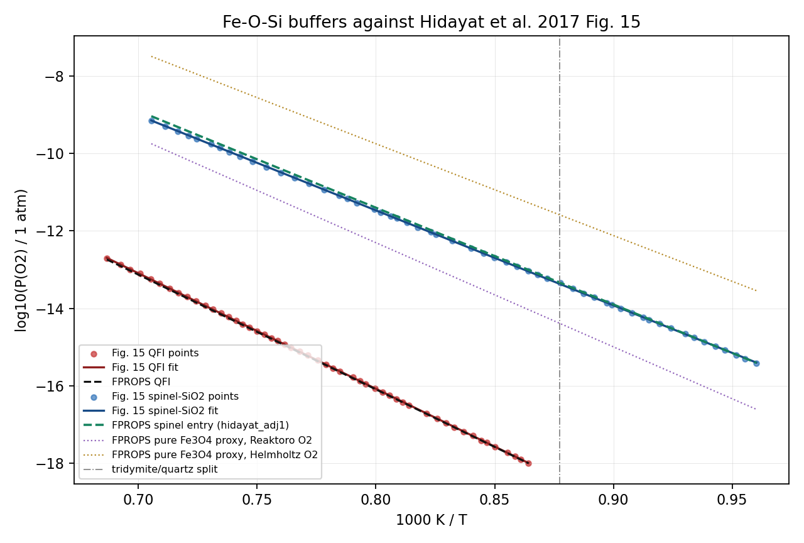

# FPROPS Si-Al / Slag Extension Note

## 1. Purpose

This note tracks the first `Si` / `Al` extension of the current
iron-reduction work in FPROPS.

The immediate goal is not a full slag thermodynamic package.
The immediate goal is to test whether gangue-derived condensed phases
can lock away iron during reduction and explain the late-stage
"flattening off" seen in TGA data for real ores.

## 2. Recommended First Scope

Start with a pragmatic pure-condensed-phase model, not a full liquid
slag or multicomponent oxide solution.

First target species:

- `SiO2`
- `Al2O3`
- `Fe2SiO4` (`fayalite`)
- `FeAl2O4` (`hercynite`)

This first package should be enough to test:

- whether `FeO` is diverted into fayalite
- whether `FeO` is diverted into hercynite
- whether those sinks materially change reduction extent under TGA-like
  conditions

## 3. Why This Scope First

Reasons to prefer this path before a full slag model:

- it directly matches the current ore-behaviour question
- it fits the current FPROPS architecture much more easily than a liquid
  slag model
- it allows immediate equilibrium calculations with `Fe-O-H-Si-Al`
  without first designing a new multicomponent solution-phase framework
- it gives a clear falsifiable test of the "iron locked in gangue
  compounds" hypothesis

Deferred for later:

- liquid oxide slag
- olivine or spinel solid solutions
- full `Fe-Al-O` or `Fe-O-Si` CALPHAD phase models
- Ca/Mg-bearing gangue chemistry

## 4. Data Strategy

Use a publication-led data collection process.

Do not start from broad WebBook crawling alone.

Recommended source order:

1. primary thermodynamic literature for `Fe2SiO4` and `FeAl2O4`
2. NIST / JANAF / WebBook for simpler unary condensed oxides
3. CALPHAD assessments only if and when pure-species treatment proves
   insufficient

### 4.1 What NIST is good for

NIST-style sources are likely suitable for:

- `SiO2`
- `Al2O3`

Possible uses:

- `Cp(T)` fits
- `S°(298.15 K)`
- `ΔfH°(298.15 K)`
- cross-checks on reference-state consistency

### 4.2 What literature is needed for

Publication data will likely be needed for:

- `Fe2SiO4`
- `FeAl2O4`

Minimum data needed for each condensed phase:

- exact phase identity
- formula
- valid temperature range
- `ΔfH°(298.15 K)`
- `S°(298.15 K)`
- `Cp(T)` correlation or directly usable `G(T)` expression
- optional density or molar volume for pressure correction

## 5. Candidate Starting References

These are the first sources to harvest.

### 5.1 `SiO2`

- NIST WebBook quartz solid-phase Shomate data:
  <https://webbook.nist.gov/cgi/cbook.cgi?ID=C14808607&Table=on&Type=JANAFS>
- This is a good first source for:
  - `Cp(T)` fit
  - `S°(298.15 K)`
  - `H° - H°298.15`
- The NIST page attributes the data to:
  - Chase, M.W., Jr., *NIST-JANAF Thermochemical Tables*, 4th ed.,
    1998

### 5.2 `Al2O3`

- NIST WebBook aluminium oxide condensed thermochemistry:
  <https://webbook.nist.gov/cgi/formula?ID=C1344281&Mask=2>
- This page gives directly useful first-pass values for:
  - `ΔfH°solid`
  - `S°solid`
  - solid-phase Shomate coefficients
- For the first pass, use the `alpha` / corundum entry unless we later
  decide another polymorph is needed.

### 5.3 `Fe2SiO4` (`fayalite`)

- Robie, Finch, Hemingway (1982), *Heat capacity and entropy of
  fayalite (Fe2SiO4) between 5.1 and 383 K: comparison of calorimetric
  and equilibrium values for the QFM buffer reaction*:
  <https://pubs.usgs.gov/publication/70011891>
- This is a strong starting source for:
  - `S°(298.15 K)`
  - `ΔfH°(298.15 K)`
  - low-temperature heat-capacity behaviour
- Benisek, Kroll, Dachs (2012), *The heat capacity of fayalite at high
  temperatures*, American Mineralogist 97(4), 657-660, DOI
  `10.2138/am.2012.3924`:
  <https://www.degruyterbrill.com/document/doi/10.2138/am.2012.3924/html>
- This is the preferred high-temperature `Cp(T)` source for a reduction
  model operating in the TGA / shaft-furnace range.
- NIST also has a formula entry for iron(II) silicate, but not an
  immediately usable condensed-thermochemistry page:
  <https://webbook.nist.gov/cgi/formula?ID=B8003045>

### 5.4 `FeAl2O4` (`hercynite`)

- Klemme and van Miltenburg (2003), *Thermodynamic properties of
  hercynite (FeAl2O4) based on adiabatic calorimetry at low
  temperatures*, American Mineralogist 88(1), 68-72, DOI
  `10.2138/am-2003-0108`:
  <https://research-portal.uu.nl/en/publications/thermodynamic-properties-of-hercynite-feal2o4-based-on-adiabatic-/>
- Open-access PDF landing page:
  <https://research-portal.uu.nl/files/319644/Klemme_p68-72_03.pdf>
- Journal / DOI page:
  <https://www.degruyterbrill.com/document/doi/10.2138/am-2003-0108/html?lang=en>
- This is the first source to use for:
  - `S°(298.15 K)`
  - low-temperature heat capacity
  - baseline standard-state thermochemistry
- Sack and Ghiorso (1991), *Thermodynamics of chromian spinels as a
  basis for single-oxide barometers and oxybarometers*, American
  Mineralogist 76, via RRUFF:
  <https://www.rruff.net/doclib/am/vol76/AM76_827.pdf>
- This provides an internally consistent spinel-side thermodynamic
  treatment including hercynite standard-state data and heat-capacity
  parameterization.

### 5.5 Later-model references

Only for later, if pure-species treatment is not enough:

- `Fe-Al-O` CALPHAD descriptions for spinel behaviour
- `Fe-O-Si` or broader oxide-slag assessments for solution phases

Possible later references:

- Hallstedt et al. (2015), thermodynamic assessment of the `Al-Fe-O`
  system
- Agca et al. (2020), `Fe-Al-O` spinel / melting model validation work

## 5A. First Data-Harvesting Table

This is the first pass of what to pull from each source.

| Species | First source | What to extract first |
|---|---|---|
| `SiO2` | NIST quartz JANAF/Shomate page | `Cp(T)`, `S°298`, `H(T)-H298`, temperature ranges |
| `Al2O3` | NIST aluminium oxide condensed thermochemistry page | `ΔfH°298`, `S°298`, solid Shomate coefficients, chosen polymorph |
| `Fe2SiO4` | Robie et al. 1982 + Benisek et al. 2012 | `ΔfH°298`, `S°298`, low-T and high-T `Cp(T)` coverage |
| `FeAl2O4` | Klemme and van Miltenburg 2003 | `S°298`, low-T `Cp(T)`, baseline standard-state values, temperature limits |

## 5B. Working Data Snapshot

This section records the first usable numbers already identified.

These are not yet the final implementation tables.
They are the current working values that determine which species can be
implemented immediately and which still need one more source.

### 5B.1 `SiO2` (`quartz`)

Working source:

- NIST WebBook / JANAF Shomate page for quartz

Current extracted values:

- phase: quartz
- valid Shomate ranges:
  - `298-847 K`
  - `847-1996 K`
- `ΔfH°(298.15 K) = -910.86 kJ/mol`
- `S°(298.15 K) = 41.44 J/mol/K`
- `Cp(298 K) = 44.57 J/mol/K`

Current Shomate coefficients:

| Range (K) | A | B | C | D | E | F | G | H |
|---:|---:|---:|---:|---:|---:|---:|---:|---:|
| 298-847 | -6.076591 | 251.6755 | -324.7964 | 168.5604 | 0.002548 | -917.6893 | -27.96962 | -910.8568 |
| 847-1996 | 58.75340 | 10.27925 | -0.131384 | 0.025210 | 0.025601 | -929.3292 | 105.8092 | -910.8568 |

Assessment:

- this is already enough for a first `shomate` implementation

### 5B.2 `Al2O3` (`alpha` / corundum)

Working sources:

- NIST WebBook condensed thermochemistry page
- NIST WebBook solid-phase Shomate page

Current extracted values:

- chosen first polymorph: `alpha` (`corundum`)
- valid Shomate range: `298-2327 K`
- `ΔfH°(298.15 K) = -1675.7 +/- 1.3 kJ/mol`
- `S°(298.15 K) = 50.92 +/- 0.10 J/mol/K`
- `Cp(298 K) = 78.77 J/mol/K`

Current `alpha`-phase Shomate coefficients:

| Range (K) | A | B | C | D | E | F | G | H |
|---:|---:|---:|---:|---:|---:|---:|---:|---:|
| 298-2327 | 102.4290 | 38.74980 | -15.91090 | 2.628181 | -3.007551 | -1717.930 | 146.9970 | -1675.690 |

Assessment:

- this is already enough for a first `shomate` implementation
- the other listed NIST polymorphs (`gamma`, `delta`, `kappa`) should
  be deferred for now

### 5B.3 `Fe2SiO4` (`fayalite`)

Working sources:

- Robie, Finch, Hemingway (1982) for low-temperature and standard-state
  properties
- Benisek, Kroll, Dachs (2012) for high-temperature `Cp(T)`

Current extracted values:

- species: fayalite, `Fe2SiO4`
- Robie 1982 anchor values at `298.15 K`:
  - `Cp(298.15 K) = 131.9 +/- 0.1 J/mol/K`
  - `S°(298.15 K) = 151.00 +/- 0.20 J/mol/K`
  - `ΔfH°(298.15 K) = -1478.17 +/- 1.30 kJ/mol`
  - `ΔfG°(298.15 K) = -1378.98 +/- 1.35 kJ/mol`
- Robie Table 3 extends the fayalite thermodynamic functions to `1400 K`
- Benisek table range: `400-2000 K`
- selected Benisek values:
  - `Cp(1000 K) = 190.64 J/mol/K`
  - `Cp(1400 K) = 203.02 J/mol/K`
  - `Cp(2000 K) = 219.43 J/mol/K`
- Benisek high-temperature `Cp(T)` fit in `J/mol/K`:
  - `Cp = -584.388 + 129440 T^-1 - 3.84956e7 T^-2 + 4.10143e9 T^-3 + 98.4368 ln(T)`

Assessment:

- fayalite now has a usable high-temperature heat-capacity model for
  reduction work
- Robie 1982 provides the missing low-temperature / `298.15 K` anchor
- combining Robie 1982 with Benisek 2012 is now sufficient for a first
  pragmatic fayalite implementation

### 5B.3A Hidayat et al. 2017 Fe-O-Si / FactSage-style fayalite

Hidayat et al. (2017), *Experimental Study and Thermodynamic
Re-optimization of the FeO-Fe2O3-SiO2 System*, is directly relevant to
our next Fe-O-Si phase-boundary checks. It is a FactSage/CRCT-style
CALPHAD re-optimization of the FeO-Fe2O3-SiO2 subsystem, building on Jak
et al. (2007) and related oxide database work.

Useful points extracted from the paper:

- quartz, tridymite and cristobalite are taken from Eriksson and Pelton
  (1993)
- hematite is taken from Hidayat et al. (2015)
- fayalite is optimized against low-temperature heat capacity / entropy,
  formation enthalpy, high-temperature heat-content data, and oxygen
  partial-pressure data
- Hidayat's optimized fayalite standard state is:
  - `Delta_f H°298 = -1478.482 kJ/mol`
  - `S°298 = 150.294 J/mol/K`
  - valid range `298-1478 K`
  - `Cp = 248.9 - 1923.8 T^-0.5 - 139104009 T^-3 J/mol/K`
- this source has now been added as an alternate `Fe2SiO4` source named
  `hidayat_2017_feo_fe2o3_sio2`, without replacing the Robie/Benisek
  source
- Jak et al. (2007) Table 1 confirms the `T^-3` coefficient is of order
  `1.391e8`; using `139.106` would overpredict room-temperature Cp

Current audit result, using Hidayat fayalite but still using the current
NIST/JANAF quartz entry:

- QFI improves slightly relative to O'Neill (1987), from about
  `-0.10..-0.13` log10 fO2 units to about `-0.03` over
  `1000-1300 K`
- QFM does not improve; the best current oxygen source remains about
  `-1.23`, `-1.06`, `-0.78` log10 fO2 units low at `1000`, `1100`,
  and `1300 K`
- this means fayalite alone is not the main QFM discrepancy; the next
  consistency work should look at the quartz polymorph data, magnetite /
  spinel basis, and O2 reference basis used by the Hidayat/Factsage
  assessment

Most useful Hidayat curves / tables to digitise or code as targets:

- Fig. 15: `log10[P(O2), atm]` versus `1000/T` for the key three-phase
  equilibria, especially fayalite-silica-iron, fayalite-spinel-iron,
  fayalite-spinel-silica, and slag-bearing equivalents
- Fig. 15 `Fe2SiO4 + SiO2 + Fe` has now been digitised as
  `test/hidayat-2017-fig15-fe2sio4-sio2-fe.dat`; over
  `1000/T = 0.686684841066..0.864238087993`, the line is
  `log10(P(O2)/1 atm) = 7.78776 - 29.8308*(1000 K/T)` with
  about `0.0066` log-unit RMS digitisation residual
- Fig. 15 blue `Fe2SiO4 + Spinel + SiO2` boundary has now been
  digitised as `test/hidayat-2017-fig15-fe2sio4-spinel-sio2.dat`;
  adjacent fields indicate `Tridymite` through the last first-series point
  at `1000/T ~= 0.8775` (`T ~= 1139.6 K`) and `Quartz`
  above that. The full line is well represented by
  `log10(P(O2)/1 atm) = 8.1539 - 24.5305*(1000 K/T)` over
  `1000/T = 0.705422652233..0.960228724777`, with about `0.0085`
  log-unit RMS digitisation residual. The printed figure label appears
  misplaced or misleading if it says `Fe2SiO4 + Spinel + Fe`.

Current Fig. 15 comparison plot:

Latest diagnostic results using the digitised Fig. 15 lines:

- QFI with Hidayat/Jak fayalite, current `SiO2`, and `oxygen=helmholtz+ref0:`
  matches the red `Fe2SiO4 + SiO2 + Fe` line with about `0.024` log-unit
  RMS residual against the digitised points.
- QFM-style `Fe2SiO4 + Spinel + SiO2` using spinel phase-entry residuals
  with `spinel=hidayat_adj1`, Hidayat/Jak fayalite, current `SiO2`, and
  `oxygen=helmholtz+ref0:` matches the blue line with about `0.063`
  log-unit RMS residual against the digitised points.
- The earlier pure-`Fe3O4` proxy was much worse: about `0.94` log-unit RMS
  with `oxygen=reaktoro_clone_supcrt98`, or about `1.75` log-unit RMS with
  `oxygen=helmholtz+ref0:`. The spinel site-solution treatment is therefore
  essential for this boundary.
- This result still uses the current `SiO2=slag_pragmatic_2026` entry rather
  than an explicit Eriksson/Pelton quartz-tridymite-cristobalite basis, so the
  next source-alignment improvement remains the silica polymorph treatment.
- Fig. 5: FeO-SiO2 pseudo-binary at iron saturation
- Fig. 16: liquidus projection / univariant lines for the FeO-Fe2O3-SiO2
  system
- Table 4: invariant-point temperatures and slag compositions; these can
  be coded directly without digitising

Priority references from Hidayat to obtain next:

- Jak et al. (2007), because Hidayat says fayalite heat capacity was
  adopted from that previous optimization
- Eriksson and Pelton (1993), for the silica polymorph standard states
  used in the FactSage/CRCT family
- Hidayat et al. (2015), for consistency of the Fe-O / hematite basis
- Decterov et al. spinel model references used by Hidayat, before trying
  to make QFM match a full FactSage-style basis
- older experimental phase-boundary sources can wait until we know which
  Hidayat figures we want to reproduce numerically

### 5B.4 `FeAl2O4` (`hercynite`)

Working sources:

- Klemme and van Miltenburg (2003)
- Sack and Ghiorso (1991)

Current extracted values:

- species: hercynite, `FeAl2O4`
- low-temperature calorimetry range: `3-400 K`
- `S°(298.15 K) = 113.9 +/- 0.2 J/mol/K`
- selected low-temperature / room-temperature values from Table 3:
  - `Cp(298.15 K) = 124.4 J/mol/K`
  - `S(298.15 K) = 113.9 J/mol/K`
- Sack and Ghiorso adopted standard-state values at `298.15 K`:
  - `S°(298.15 K) = 115.362 J/mol/K`
  - `ΔfH°(298.15 K) = -1947.681 kJ/mol`
- Sack and Ghiorso also provide a hercynite heat-capacity
  parameterization for temperatures above `298 K` within their spinel
  thermodynamic framework

Assessment:

- Klemme remains the best low-temperature calorimetry anchor
- Sack and Ghiorso is now the preferred implementation source because
  it gives a complete thermodynamic framework usable above `298 K`
- the discrepancy between Klemme `S°298 = 113.9` and Sack/Ghiorso
  `S°298 = 115.362` should be recorded and treated as a model-choice
  uncertainty, not ignored
- Verma 2024 remains useful as a qualitative high-temperature cross-
  check, but its printed coefficient table should not be trusted
  verbatim

## 5C. Readiness For First Implementation

Current implementation readiness by species:

- `SiO2`: ready now, `shomate`
- `Al2O3`: ready now, `shomate`
- `Fe2SiO4`: ready enough now for first implementation using Robie 1982
  plus Benisek 2012
- `FeAl2O4`: ready enough now for a first provisional implementation
  using Sack and Ghiorso 1991, with Klemme 2003 retained as a
  low-temperature cross-check

## 6. First Thermodynamic Reactions To Validate

These should be used as the first consistency checks once data are added:

- `2 FeO + SiO2 -> Fe2SiO4`
- `FeO + Al2O3 -> FeAl2O4`

Current literature anchor quality is asymmetric:

- for the `Fe-O-Si` side, the quartz-fayalite-magnetite (`QFM`) buffer
  gives a real external equilibrium reference
- for the `Fe-O-Al` / hercynite side, we currently have sound
  thermodynamic source data but not yet one equally clean benchmark
  dataset wired into the repo
- therefore the first full `Fe-O-H-Si-Al` regression should be treated
  as a physically directed capture test, not yet as a full
  literature-calibrated validation case

And then in the reduction context:

- `Fe2O3 / Fe3O4 / wustite / Fe` competition in the presence of
  `SiO2`
- `Fe2O3 / Fe3O4 / wustite / Fe` competition in the presence of
  `Al2O3`
- mixed-gangue competition with both `SiO2` and `Al2O3`

## 7. FPROPS Implementation Plan

### 7.1 Phase-model choice

First implementation should use pure condensed species only.

That means:

- no new liquid-slag phase model yet
- no new multicomponent solid solution yet
- use the existing pure condensed species path in `eqm`

### 7.2 Likely data representation

Prefer the simplest representation that preserves chemistry:

- use `shomate` data if a defensible `Cp(T)` form can be assembled
- otherwise use a pragmatic condensed `gibbs_species` entry if a direct
  `G(T)` fit is available or can be fitted reliably from the source

Current working choice:

- `SiO2`: `shomate`
- `Al2O3`: `shomate`
- `Fe2SiO4`: ready for `shomate`-style or equivalent fitted `Cp(T)` form
  using Robie 1982 for the anchor and Benisek 2012 for the high-T fit
- `FeAl2O4`: use Sack and Ghiorso 1991 as the first implementation
  basis; use Klemme 2003 and Verma 2024 only as cross-checks

### 7.3 Initial package composition

First equilibrium package for testing should likely contain:

- `Fe_bcc`
- `Fe_fcc`
- `Fe2O3`
- `Wus_FeO`
- `Wus_FeO1p5`
- `Sp_Fe2_tet`
- `Sp_Fe3_tet`
- `Sp_Fe2_oct`
- `Sp_Fe3_oct`
- `Sp_Va_oct`
- `SiO2`
- `Al2O3`
- `Fe2SiO4`
- `FeAl2O4`
- `hydrogen`
- `water`

Later carbon-bearing additions can be layered on after this.

## 8. Verification / Validation Concept

The first pass needs two distinct layers:

- verification: does the code reproduce the chosen source data and stay
  numerically well behaved?
- validation: does the resulting equilibrium model explain the ore /
  TGA behaviour we care about?

### 8.1 Current verification layer

The first implemented checks should stay close to the source data:

- source lookup for `SiO2`, `Al2O3`, `Fe2SiO4`, `FeAl2O4`
- `Cp(T)` spot checks at room temperature and a representative
  high-temperature point
- reference-state anchor checks at `298.15 K` for `ΔfH°` and `S°`
- `mu0(T)` finite-value checks at reactor-relevant temperatures
- full regression run through `cutest` so the new source does not break
  the existing equilibrium machinery

These checks answer "did we code the chosen thermo model correctly?"

We now also have first external equilibrium anchors on the `Fe-O-Si`
side:

- a `QFM` buffer regression at `1000 K`, comparing the mixed-source
  `Fe3O4 + SiO2 + Fe2SiO4 + O2` chemical-potential balance against the
  low-temperature O'Neill 1987 relation
- a `QFI` buffer regression at `1000 K`, comparing the mixed-source
  `2Fe + SiO2 + O2 = Fe2SiO4` balance against the O'Neill 1987 relation
- for `QFM`, `oxygen=reaktoro_clone_supcrt98` is currently a better
  mixed-source match than `oxygen=helmholtz+ref0:` or
  `oxygen=Moran and Shapiro`
- for `QFI`, `oxygen=helmholtz+ref0:` is currently the better
  mixed-source match, which is consistent with that benchmark sitting on
  the reduced iron side rather than the magnetite side
- the audit can now vary fayalite between `slag_pragmatic_2026`
  (Robie/Benisek) and `hidayat_2017_feo_fe2o3_sio2`

This is still only a first-pass validation anchor, because it mixes
species from different source families, but it is strong enough to catch
gross fayalite-buffer errors.

For ongoing source-alignment work, use
`test/feosial_source_audit.py` to print the current `QFM` / `QFI`
offsets together with a small gas-reaction audit. This makes it easier
to separate "oxygen / gas basis" issues from "condensed fayalite / iron
oxide basis" issues.

### 8.2 Next verification layer

The next code-level checks should exercise equilibrium package
behaviour, not just unary species functions:

- build a small `Fe-O-H-Si-Al` package with the new species present
- confirm that source-map resolution works cleanly in mixed packages
- check that equilibrium solves remain stable when gangue phases are
  admitted
- add regression cases that assert nonzero fayalite / hercynite
  formation under feeds where those phases should be admissible

One caution: reaction-level `ΔG` tests for
`2 FeO + SiO2 -> Fe2SiO4` and `FeO + Al2O3 -> FeAl2O4` should wait
until the `FeO` basis used in those checks is upgraded from the current
placeholder condensed model. Otherwise the test would be numerically
consistent but physically weak.

### 8.3 Validation layer against ore behaviour

Once the package-level verification is in place, validation should
focus on the real ore question:

- compare predicted phase assemblages with and without `SiO2` /
  `Al2O3`
- quantify how much Fe is diverted into `Fe2SiO4` and `FeAl2O4`
- compare the resulting reducible-Fe fraction against the TGA plateau
  / flattening trend
- run sensitivity cases on gangue inventory and temperature to see
  whether the flattening onset moves in the same direction as the
  experiments
- treat hercynite as the higher-uncertainty branch and check model
  sensitivity to the chosen hercynite data basis

## 9. Immediate Next Actions

Recommended next work after the current species implementation:

1. download Jak et al. (2007), Eriksson and Pelton (1993), and
   Hidayat et al. (2015) if available
2. digitise Hidayat Fig. 15 first; code Table 4 invariant points directly
3. add one first mixed `Fe-O-H-Si-Al` equilibrium regression case
4. exercise gangue-bearing source maps and package construction
5. compare equilibrium outputs with a simple ore-like element feed
6. only then add reaction-level `ΔG` regression checks, once the `FeO`
   reference basis used in those checks is no longer placeholder-only
7. compare the predicted Fe lock-up against the TGA flattening
   interpretation

## 10. Working Position

The first `Si/Al` extension should be treated as an ore-capture model,
not yet as a true slag model.

If this simple pure-phase extension already explains the observed TGA
flattening, it is probably the right next level of model fidelity.
If not, the next step is likely a proper oxide solution / slag model.
